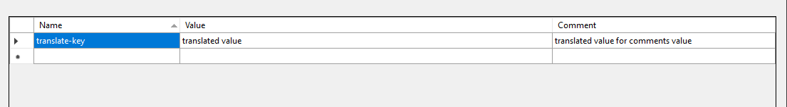

## Çalışma Mantığı ve Teknik Detay
Dotnet Core projelerinde `JSON tabanlı` çeviri işlemleri, özellikle büyük ölçekli uygulamalarda yönetim açısından karmaşık olabilir. Bunun nedeni, dotnet core'un doğrudan `JSON tabanlı` çeviri işlemleri için **doğal bir destek sunmamasıdır.** `JSON tabanlı` çeviri işlemleri, her istek aldığında JSON dosyasının parse edilip, gerekli verilerin çıkarılması gibi işlemler gerektirir. Bu durum, özellikle yüksek trafikli uygulamalarda performans sorunlarına neden olabilir.

**Buna karşılık, dotnet'in Resource dosyalarıyla çalışması daha performanslıdır.** Resource dosyaları derleme zamanında optimize edilebilir ve istek anında parse edilmesine gerek kalmaz. Bu, çeviri verilerinin daha hızlı bir şekilde erişilebilir olmasını sağlar.

Bu nedenle, genellikle dotnet Core projelerinde çeviri işlemleri için JSON dosyaları yerine Resource dosyaları tercih edilir. Ancak, bazı durumlarda mevcut altyapının korunması veya geçiş sürecinde kolaylık sağlamak için `JSON tabanlı` çeviri yapısı tercih edilebilir. Bu durumda, JSON çeviri dosyaları, proje başlatılmadan önce derleme zamanında Resource dosyalarına dönüştürülür ve uygulama çalışırken Resource dosyalarından veri okunarak çeviri işlemleri gerçekleştirilir. Bu yaklaşım, performansı artırırken aynı zamanda mevcut altyapının kullanılmasını da sağlar.

**Not:** Publish almadan önce projenin en az 1 kere çalış olması gerekir. Çünkü; JSON içerisine eklenmiş çevirilerin Resource'a çevrilip Resources klasörü içerisine eklenmesi gerekir. Aksi taktirde publish aldıktan sonra çeviriler çalışmayacaktır. 

# Json Syntax
1. Çeviri ekleme.
: Yeni çeviri ekleme örneği aşağıdaki gibidir.
``` json
{
    "translate-key": "translated value"
}
```

2. Çevirileri Gruplama
: Çevirileri belli başlı bir başlık / grup altına alinabilir.
``` json
{
    "Test Group or title": {
        "translate-key": "translated value"
    }
}
```

ya da grup olduğunu `-Group` olarak belirtmek gerekir.
``` json
{
    "Test Group or title-Group": {
        "translate-key": "translated value"
    }
}
```

Gruplar sonsuz derinliği destekler. Fakat `translate-key` her zaman benzersiz olmak zorundadir.

3. Resx görünümde, çeviriye yorum satırı ekleme.
: Bu özellik, her çeviriye 1 adet yorum satırı eklemeyi sağlar. Visual Studio içerisinde resx görünümü açıldığında çevirinin yanında yorum satırı olarak görünür. 
: Yorum satırını eklemeyi sağlaya anahtar ise `=Comments` ifadesidir. Büyük/Küçük harf duyarlılığı yoktur.
Örnek:
``` json
{
    "translate-key": "translated value",
    "translate-key=Comments": "translated value for comments value"
}
```
Örnek görünüm şu şekilde olacaktır:



## API projesinde çıktı örnekleri
Seçili Dil: **Almanca**


Seçili Dil: **Türkçe**


## MVC projesinde çıktı örnekleri
Seçili Dil: **Almanca**


Seçili Dil: **Türkçe**


