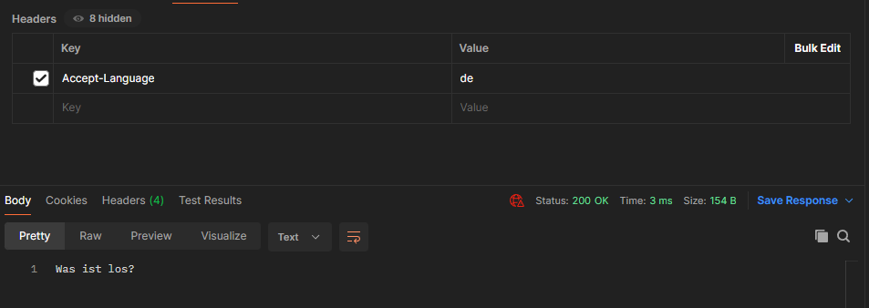
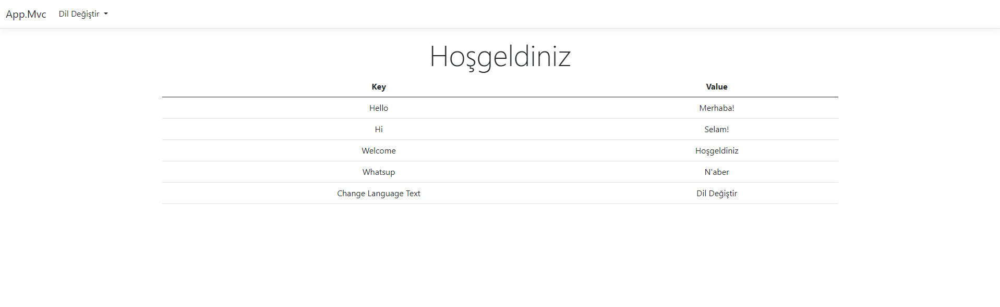

## Working Logic and Technical Details
In Dotnet Core projects, JSON-based translation processes can be complex, especially in large-scale applications. **This is because Dotnet Core does not provide direct native support for JSON-based translation processes.** JSON-based translation processes require parsing the JSON file and extracting the necessary data with each request received. This can lead to performance issues, especially in high-traffic applications.

**In contrast, working with Resource files in Dotnet is more efficient.** Resource files can be optimized at compile time, and there is no need for parsing them at runtime. This allows translation data to be accessed more quickly.

Therefore, Resource files are typically preferred over JSON files for translation processes in Dotnet Core projects. However, in some cases, a JSON-based translation structure may be preferred to maintain existing infrastructure or to facilitate the transition process. In this scenario, JSON translation files are converted to Resource files at compile time, and translation processes are carried out by reading data from Resource files while the application is running. This approach enhances performance while allowing the utilization of existing infrastructure.

**Note:** The project must be run at least once before publishing. This is because translations added to the JSON need to be converted to resources and added to the Resources folder. Otherwise, the translations will not work after publishing.

# JSON Syntax
1. Adding Translation
: Example of adding a new translation is as follows.
``` json
{
    "translate-key": "translated value"
}
```

2. Grouping Translations
: Translations can be grouped under a specific title/group.
``` json
{
    "Test Group or title": {
        "translate-key": "translated value"
    }
}
```
or specify that it's a group by appending `-Group`.
``` json
{
    "Test Group or title-Group": {
        "translate-key": "translated value"
    }
}
```
Groups support infinite depth. However, `translate-key` must always be unique.

3. Adding Comments to Translation in Resx View
: This feature allows adding 1 comment line to each translation. When viewed in Visual Studio's resx view, it appears as a comment line next to the translation.
: The key to enabling comment addition is the `=Comments` expression. Case sensitivity does not matter.
Example:
``` json
{
    "translate-key": "translated value",
    "translate-key=Comments": "translated value for comments value"
}
```
The view will look like this:


## Output Examples in API Project
Selected Language: **Deutsch**



Selected Language: **Türkçe**


## Output Examples in MVC Project
Selected Language: **Deutsch**


Selected Language: **Türkçe**



